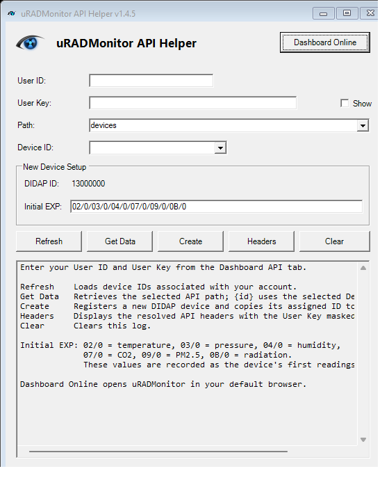

# uRADMonitor API Helper

A small desktop helper for the [uRADMonitor](https://www.uradmonitor.com/) REST API. It builds the required authentication headers (`X-User-id` / `X-User-hash`), lets you query device data, and can register a new device through the DIDAP flow.

This project is intentionally GUI-first. Run either application and work from its interface. The PowerShell GUI is the primary documented option, while the Python GUI is available for users who prefer Python:

- Windows PowerShell: run `uRADMonitor - Get API Headers and Data.ps1`
- Python: run `uradmonitor_api_gui.py`

No special command-line parameters are required for normal use.

## Features

- Builds the uRADMonitor authentication headers for each request
- Loads device IDs from your account
- Queries any selected API path
- Registers a new DIDAP device and stores the assigned ID
- Validates EXP values and device IDs before upload
- Opens the dashboard in the browser from the GUI

## Requirements

- Internet access to `https://data.uradmonitor.com`
- A [uRADMonitor Dashboard](https://www.uradmonitor.com/dashboard) account
- Your Dashboard API User ID and User Key from the API tab
- Python 3 and the `requests` package, if using the Python version

## Files

| File | Purpose |
| --- | --- |
| `uRADMonitor - Get API Headers and Data.ps1` | Windows GUI version of the helper |
| `uradmonitor_api_gui.py` | Optional Python GUI version of the helper |
| `uradmonitor-logo-2026.png` / `uradmonitor-logo-2026.ico` | Branding assets for the interface |
| `gui-screenshot.png` | Screenshot of the Windows PowerShell GUI |

## Run the app

### Windows PowerShell

```powershell
.\uRADMonitor - Get API Headers and Data.ps1
```

### Python alternative

Install the Python dependency if needed:

```powershell
py -3 -m pip install requests
```

Then launch the Python GUI:

```powershell
py -3 .\uradmonitor_api_gui.py
```

The Python version provides the same GUI workflow and API operations as the PowerShell version.

Then simply use the GUI to:

- enter your User ID and User Key
- choose a device and API path
- click Refresh, Get Data, Create, or Headers
- view results in the output panel

## Screenshots

### Windows GUI



## Authentication

Every request is authenticated with two headers:

| Header | Value |
| --- | --- |
| `X-User-id` | Your account User ID |
| `X-User-hash` | Your Dashboard API User Key |

> The User Key is not your login password. Copy the values from the uRADMonitor Dashboard API tab and enter them in the GUI.

## Common API paths

Relative to `https://data.uradmonitor.com/api/v1/`:

| Path | Returns |
| --- | --- |
| `devices` | Devices visible to the account |
| `devices/<deviceId>` | Latest reading for a device |
| `devices/<deviceId>/all/3600` | Last hour of device history |

## Device registration

The GUI can create a new DIDAP device. It sends a registration upload with the placeholder device ID `13000000`, and the server responds with a new assigned device ID in the form `13xxxxxx`.

Store the returned Device ID and use it for all future uploads.

## Security notes

- Keep your User ID and User Key private
- Do not create many DIDAP IDs in quick succession
- Do not repeatedly upload dummy data
- Keep the assigned device ID in non-volatile storage on the device

## References

- [uRADMonitor Dashboard](https://www.uradmonitor.com/dashboard)
- [uRADMonitor Dashboard 09](https://www.uradmonitor.com/tools/dashboard-09/)
- [Open data upload tutorial](https://www.uradmonitor.com/open-data-upload-tutorial/)

Released under the [MIT License](LICENSE).

Copyright &copy; DonZalmrol

## Author

**DonZalmrol**

- GitHub: <https://github.com/DonZalmrol/>
- Website: <https://www.don-zalmrol.be/>
