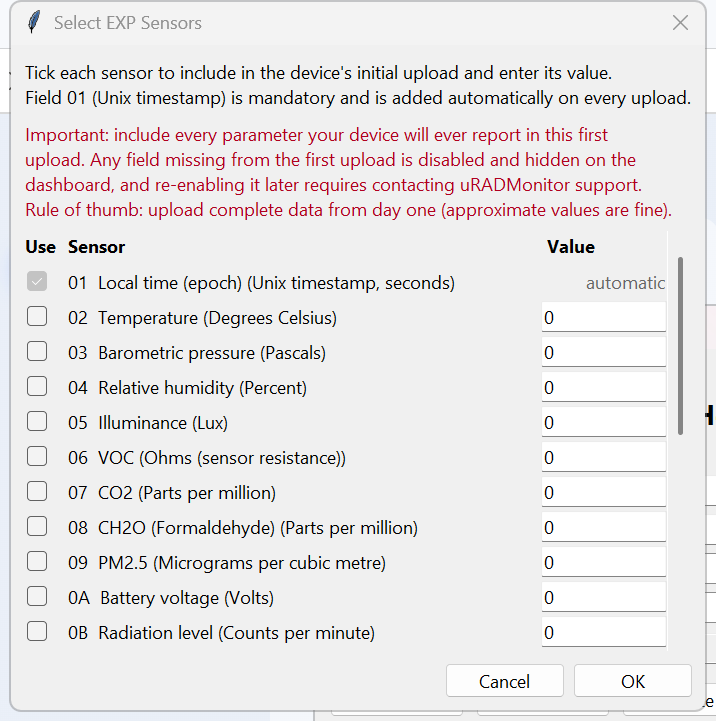
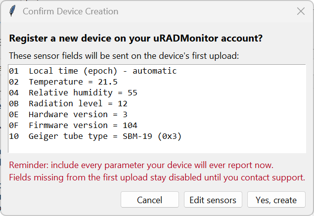

# uRADMonitor API Helper

A small Python desktop helper for the [uRADMonitor](https://www.uradmonitor.com/) REST API. It builds the required authentication headers (`X-User-id` / `X-User-hash`), lets you query device data, and can register a new device through the DIDAP flow.

This project is GUI-first. Run the application and work from its interface:

- Python: run `uradmonitor_api_gui.py`

No special command-line parameters are required for normal use.

## Features

- Builds the uRADMonitor authentication headers for each request
- Loads device IDs from your account
- Queries any selected API path
- Picks a device's initial EXP sensors from a checkbox dialog, with the mandatory Unix timestamp added automatically
- Offers a Geiger tube type dropdown (with a custom option) and sensible hardware/firmware version defaults
- Confirms the sensor list before registering a new DIDAP device
- Registers a new DIDAP device and stores the assigned ID
- Validates EXP values and device IDs before upload
- Opens the dashboard in the browser from the GUI

## Requirements

- Python 3 and the `requests` package
- Internet access to `https://data.uradmonitor.com`
- A [uRADMonitor Dashboard](https://www.uradmonitor.com/dashboard) account
- Your Dashboard API User ID and User Key from the API tab

## Files

| File | Purpose |
| --- | --- |
| `uradmonitor_api_gui.py` | Python GUI version of the helper |
| `uradmonitor-logo-2026.png` / `uradmonitor-logo-2026.ico` | Branding assets for the interface |
| `gui-screenshot.png` | Screenshot of the main GUI |
| `exp-menu-screenshot.png` | Screenshot of the Select EXP Sensors dialog |
| `create-device-screenshot.png` | Screenshot of the Confirm Device Creation dialog |

## Run the app

Install the Python dependency if needed:

```powershell
py -3 -m pip install requests
```

Then launch the GUI:

```powershell
py -3 .\uradmonitor_api_gui.py
```

Then simply use the GUI to:

- enter your User ID and User Key
- choose a device and API path
- click Refresh, Get Data, Create, or Headers
- view results in the output panel

## Screenshots






## Authentication

Every request is authenticated with two headers:

| Header | Value |
| --- | --- |
| `X-User-id` | Your account User ID |
| `X-User-hash` | Your Dashboard API User Key |

> The User Key is not your login password. Copy the values from the uRADMonitor Dashboard API tab and enter them in the GUI.

## Common API paths

Relative to `https://data.uradmonitor.com/api/v1/`:

| Path | Returns |
| --- | --- |
| `devices` | Devices visible to the account |
| `devices/<deviceId>` | Latest reading for a device |
| `devices/<deviceId>/all/3600` | Last hour of device history |

## Device registration

The GUI can create a new DIDAP device. Click **Select sensors...** to choose the EXP fields the device will report on its first upload:

- The Unix timestamp (field `01`) is mandatory and added automatically.
- Hardware version (`0E`) and firmware version (`0F`) are pre-filled with defaults (`3` and `104`) and remain editable.
- The Geiger tube type (`10`) is chosen from a dropdown of known tubes, with a custom option for any tube not listed.

> Include every parameter the device will ever report in this first upload. Fields missing from the first upload stay disabled on the dashboard until you contact uRADMonitor support.

Before registering, a confirmation dialog summarises the sensors to be sent (Yes / Edit sensors / Cancel). On confirmation, the helper sends a registration upload with the placeholder device ID `13000000`, and the server responds with a new assigned device ID in the form `13xxxxxx`.

Store the returned Device ID and use it for all future uploads.

## Security notes

- Keep your User ID and User Key private
- Do not create many DIDAP IDs in quick succession
- Do not repeatedly upload dummy data
- Keep the assigned device ID in non-volatile storage on the device

## References

- [uRADMonitor Dashboard](https://www.uradmonitor.com/dashboard)
- [uRADMonitor Dashboard 09](https://www.uradmonitor.com/tools/dashboard-09/)
- [Open data upload tutorial](https://www.uradmonitor.com/open-data-upload-tutorial/)

Released under the [MIT License](LICENSE).

Copyright &copy; 2026 DonZalmrol

## Author

**DonZalmrol**

- GitHub: <https://github.com/DonZalmrol/>
- Website: <https://www.don-zalmrol.be/>
- uRADMonitor: <https://www.uradmonitor.com/>
